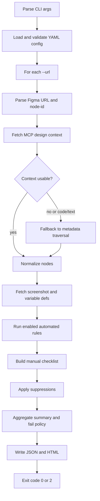
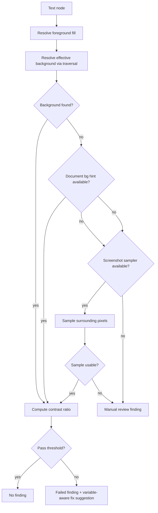
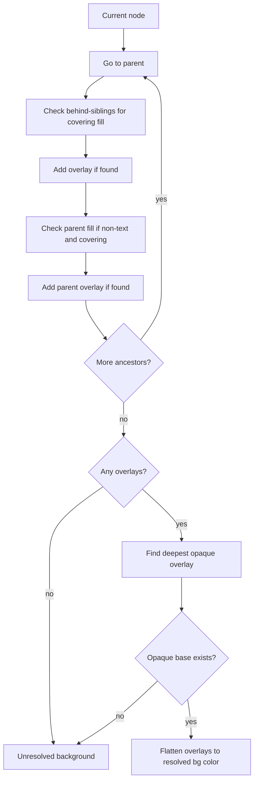
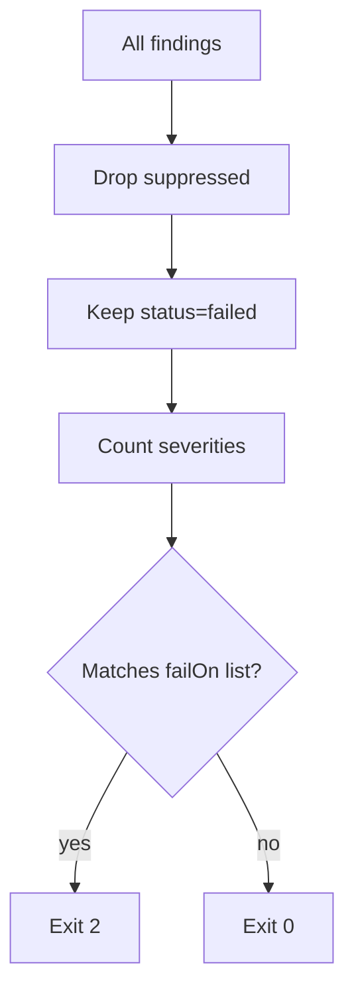

# AA Auditor

`aa-auditor` is a TypeScript CLI that audits specific Figma frame/layer URLs against core **WCAG 2.2 AA** design checks.

It is built for CI and design QA workflows where you want deterministic machine-readable output (`JSON`) and human-readable output (`HTML`) with screenshots.

## What This Tool Does

- Audits one or more explicit Figma URLs per run (`--url` repeatable)
- Uses Figma MCP as the source of truth for node structure, metadata, variables, and screenshots
- Runs high-confidence automated checks:
  - `WCAG-1.4.3-text-contrast-minimum`
  - `WCAG-1.4.11-nontext-contrast`
  - `WCAG-2.5.8-target-size-minimum`
- Emits embedded manual-review checklist items (non-failing)
- Supports time-bound suppressions (`reason` + `expiresOn` required)
- Fails CI with exit code `2` when findings match configured fail severities

## Core Capabilities

- MCP-backed Figma input (`get_design_context`, `get_metadata`, `get_screenshot`, `get_variable_defs`)
- Metadata fallback + sublayer expansion when design context is truncated or code/text shaped
- Transparent-frame-aware background traversal for contrast checks
- Invisible and zero-opacity layers ignored during normalization
- Layer-path reporting with full nesting (`A > B > C`)
- Variable-aware color fix suggestions from Figma variables and config token overrides
- Live stage-by-stage terminal progress for each URL

## Prerequisites

- Node.js `20+`
- Figma OAuth token in env: `FIGMA_OAUTH_TOKEN`
- Reachable MCP endpoint:
  - Hosted: `https://mcp.figma.com/mcp`
  - Local desktop bridge: `http://127.0.0.1:3845/mcp`

Important for local MCP:

- Keep the Figma desktop app open
- Keep the target file open/accessible in desktop
- If desktop closes or file context is missing, MCP calls can fail or downgrade to partial metadata

## Environment Variables

The CLI auto-loads `.env` from current working directory.

Example file is provided at `/Users/khangelani/Documents/aa_dauditor/.env.example`.

| Variable | Required | Default | Notes |
|---|---:|---|---|
| `FIGMA_OAUTH_TOKEN` | Yes | none | OAuth token used for MCP auth |
| `FIGMA_MCP_URL` | No | `https://mcp.figma.com/mcp` | Set to local bridge for desktop mode |
| `FIGMA_REGION` | No | `us-east-1` | Header used by hosted MCP |
| `FIGMA_MCP_TIMEOUT_MS` | No | `60000` | Per-MCP-request timeout |
| `FIGMA_SUBLAYER_EXPANSION_LIMIT` | No | `16` | Max expanded child contexts when context is truncated |

## Quickstart

### 1. Install and build

```bash
npm install
npm run build
```

### 2. Configure environment

```bash
cp .env.example .env
# edit .env and set FIGMA_OAUTH_TOKEN
```

### 3. Initialize config

```bash
aa-auditor config init
```

This writes `/Users/khangelani/Documents/aa_dauditor/.aa-auditor.yml`.

### 4. Run health check

```bash
aa-auditor health --url "https://www.figma.com/design/FILE_KEY/Frame?node-id=1-2"
```

### 5. Run audit

```bash
aa-auditor audit \
  --url "https://www.figma.com/file/FILE_KEY/Frame?node-id=1-2" \
  --out ./out
```

## Install as Standalone CLI

```bash
npm install
npm run build
npm link
```

Then run from any path:

```bash
aa-auditor --help
aa-auditor --version
```

Without global link:

```bash
npm exec -- aa-auditor --help
```

## CLI Commands

### `audit`

```bash
aa-auditor audit \
  --url <figma_url> [--url ...] \
  --out <dir> \
  [--config <path>] \
  [--format json|html|both] \
  [--fail-on blocker,critical]
```

### `health`

```bash
aa-auditor health [--url <figma_url>]
```

### `rules list`

```bash
aa-auditor rules list
```

### `config init`

```bash
aa-auditor config init [--path <path>] [--force]
```

## Exit Codes

- `0`: run succeeded and no gate-triggering severities
- `2`: run succeeded and findings match fail threshold
- `1`: runtime/config/fetch error

## Output Artifacts

- JSON report: `<out>/audit-report.json`
- HTML report: `<out>/audit-report.html`
- Screenshot assets: `<out>/assets/*` (when screenshot bytes are available)

## Config Reference

Default config schema:

```yaml
wcagVersion: "2.2"
level: "AA"
failOn:
  - blocker
  - critical
report:
  includeScreenshots: true
  formats:
    - json
    - html
rules:
  WCAG-1.4.3-text-contrast-minimum:
    enabled: true
    severity: critical
  WCAG-1.4.11-nontext-contrast:
    enabled: true
    severity: major
  WCAG-2.5.8-target-size-minimum:
    enabled: true
    severity: major
designSystemColors: {}
suppressions: []
```

Suppression item:

```yaml
suppressions:
  - ruleId: WCAG-1.4.3-text-contrast-minimum
    targetId: "26046:12036"
    reason: "Header text contrast approved by design review on light surface"
    expiresOn: "2026-04-30"
    owner: "design-systems"
```

## Rule Coverage

### Automated (failing)

- `WCAG-1.4.3` Text contrast minimum
- `WCAG-1.4.11` Non-text contrast
- `WCAG-2.5.8` Target size minimum

### Embedded manual checklist (non-failing)

- `WCAG-1.3.1` Info and relationships
- `WCAG-1.4.1` Use of color
- `WCAG-2.4.7` Focus visible
- `WCAG-2.4.11` Focus not obscured
- `WCAG-3.3.2` Labels or instructions

## Algorithm Overview

### End-to-end audit pipeline



### Contrast resolution strategy

Text contrast checks do not stop at immediate parent fill. They use layered resolution in this order:

1. Transparent-aware ancestor and sibling-underlay traversal
2. Metadata-fallback accumulated-bounds coverage checks
3. Code-style-derived background hints (when code/text payload exists)
4. Screenshot sampling around text bounds (PNG screenshot fallback)
5. If still unresolved: `needs-manual-review` (no false hard-fail)

Note:

- Screenshot sampling fallback currently applies to `WCAG-1.4.3` (text contrast).
- `WCAG-1.4.11` uses traversal + metadata/code-derived background data, and falls back to manual review when unresolved.



### Transparent-frame background traversal

For each target node, the resolver climbs ancestors and also checks older siblings (underlays) at each level.

Rules:

- Ignore invisible paints and alpha-zero paints
- Ignore text nodes as backdrop candidates
- Require covering geometry (raw bounds; accumulated bounds in metadata fallback)
- Compose translucent overlays until the first opaque base is reached



### CI fail policy



## Variable-Aware Recommendations

When contrast fails and design-system tokens are available, recommendations include:

- `Fix A`: replace foreground token
- `Fix B`: replace background token (opaque token colors only)
- `Fix C`: replace both with closest passing pair

Token sources are merged in this order:

1. Figma variable definitions (`get_variable_defs`)
2. Explicit `designSystemColors` in config (overrides)

Config override example:

```yaml
designSystemColors:
  text.primary: "#1F2937"
  text.inverse: "#FFFFFF"
  border.default: "#CBD5E1"
```

## Progress Output

The CLI prints stage progress per target:

- `fetch`
- `normalize`
- `screenshot`
- `rules`
- `suppressions`
- `manual-checklist`
- `finalize-target`
- `write-report`

This gives a pull/download style progress stream in terminal for long MCP operations.

## Troubleshooting

### Local MCP fails to connect

Symptoms:

- `connect EPERM 127.0.0.1:3845`
- MCP initialize failures

Actions:

- Ensure Figma desktop is running
- Ensure local MCP bridge endpoint is correct in `FIGMA_MCP_URL`
- Keep the target file open in Figma desktop

### `get_design_context` returns code/text payload

This is supported. Auditor switches to metadata traversal and extracts style hints from code (`data-node-id` classes) to preserve coverage.

Expected warning in report:

- `get_design_context returned code/text payload; switching to metadata for layer traversal.`

### Persistent manual-review contrast item on nested header text

Example case:

- `Tracking Map - sideOpen > Shift History > Shift History Header > Shift History Page Title > Resource Page`

Why it happens:

- Some MCP responses contain hierarchy and bounds but no ancestor fill paints for that subtree.

Mitigations now in engine:

- Transparent traversal through ancestor/sibling stack
- Code-derived background hint fallback
- Screenshot sampling fallback around node bounds

If all data sources remain inconclusive, result is intentionally `needs-manual-review` (not false fail).

### MCP rate limit errors

Symptoms:

- `Rate limit exceeded, please try again tomorrow`

Actions:

- Wait for Figma MCP quota reset
- Run `aa-auditor health` first to validate endpoint before large runs
- Reduce repeated retry loops in local debugging scripts

### Missing screenshots in HTML

If screenshot bytes are unavailable from MCP, audit continues and report includes findings without image evidence.

## JSON Report Shape (high level)

```json
{
  "runId": "...",
  "startedAt": "...",
  "finishedAt": "...",
  "wcagVersion": "2.2",
  "level": "AA",
  "summary": {
    "totalTargets": 1,
    "totalFindings": 0,
    "suppressedFindings": 0,
    "manualReviewFindings": 0,
    "bySeverity": {
      "blocker": 0,
      "critical": 0,
      "major": 0,
      "minor": 0
    },
    "failedTargets": 0,
    "warnings": []
  },
  "targets": [],
  "findings": [],
  "manualChecks": []
}
```

Finding fields include:

- `id`, `ruleId`, `wcagCriterion`, `severity`, `status`
- `message`, `recommendation`, `evidence`
- `targetRef` with `figmaUrl`, `nodeId`, `frameName`, `layerPath`
- optional `suppressed`

## Testing

```bash
npm test
```

Current test coverage includes:

- Color math and thresholds
- Rule behavior for contrast and target size
- Suppression expiry and matching
- Transparent-background resolution and sibling underlay logic
- Metadata-fallback accumulated bounds handling
- Code-style hint parsing
- Screenshot sampler background fallback
- Integration snapshots and exit policy behavior

## Notes for CI

Typical CI run:

```bash
npm ci
npm run build
node dist/src/cli.js audit --url "$FIGMA_URL" --out out --format both --fail-on blocker,critical
```

If any unsuppressed `blocker` or `critical` failed finding exists, the process exits with `2`.
